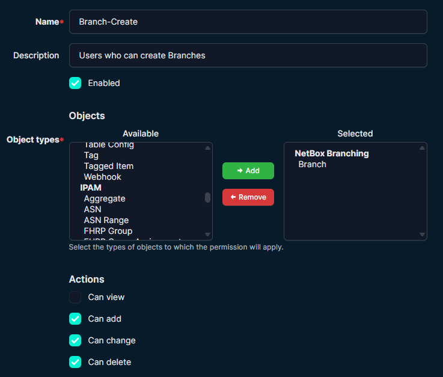
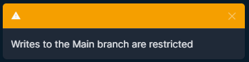
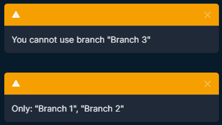
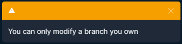

# Netbox-Branch-Guard
This Netbox middleware plugin can be used to guard against writes to the Main branch in Netbox.
It can also be setup to enforce branch ownership checks and control which branches users are able to write into.

It is used in conjunction with the Netbox Branching plugin [Netbox Branching](https://github.com/netboxlabs/netbox-branching).

>[!NOTE]
> This module has only been tested in conjuction with Netbox Community Edition.
> Please ensure that you fully test the behaviour of this module in a test environment before using in production. 

## Compatibility

| Release | Minimum NetBox Version | Maximum NetBox Version |
|---------|------------------------|------------------------|
| 1.0.0   | 4.6.0                  | 4.6.x                  |
| 1.0.1   | 4.6.0                  | 4.6.x                  |
| 1.0.2   | 4.6.0                  | 4.6.x                  |
| 1.0.3   | 4.6.0                  | 4.6.x                  |
| 1.0.4   | 4.6.0                  | 4.6.x                  |

## Requirements
- NetBox 4.x
- Netbox-Branching plugin for branch operations
- Python 3.10+

## Installation
1) Install the plugin:
```sh
pip install netbox-branch-guard 
```

2) Enable in NetBox configuration.py:

### netbox-branching _must_ come last

```python
PLUGINS = [
    "netbox_branch_guard",
    "netbox_branching",
]

PLUGINS_CONFIG = {
    "netbox_branch_guard": {            # Default setting in (brackets)
      "enabled": True,                  # (True) / False = plugin is enabled.
      "api_bypass": True,               # (True) / False = API can write to Main, else it's blocked.
      "superuser_bypass": True,         # (True) / False = Superuser can write to Main, else it's blocked.
      "enforce_ownership": False,       # (True) / False = Users can only write to branches they own.
      "logging": True,                  # True / (False) = Output detailed logging to the netbox log.

      "group_branch_map": {             # Optional - Map user groups to their allowed branches. Wildcards are allowed.
          "Group 1": ["Branch 1", "Branch 2"],
          "Group 2": ["Branch 3"],
          "Group AB *": ["Branch AB *"],
      },
    },
}
```

3) Migrate:
```sh
python manage.py migrate
```

4) Restart NetBox.

## Using Netbox-Branch-Guard with NetBox Docker

1. Configure the plugin
Create plugins.py to store the plugin's configuration.

2) Add netbox_branch_guard to PLUGINS and PLUGINS_CONFIG in plugins.py

>[!IMPORTANT]
>netbox-branching _must_ come last

```python
PLUGINS = [
    "netbox_branch_guard",
    "netbox_branching",
]

PLUGINS_CONFIG = {
    "netbox_branch_guard": {            # Default setting in (brackets)
      "enabled": True,                  # (True) / False = plugin is enabled.
      "api_bypass": True,               # (True) / False = API can write to Main, else it's blocked.
      "superuser_bypass": True,         # (True) / False = Superuser can write to Main, else it's blocked.
      "enforce_ownership": False,       # (True) / False = Users can only write to branches they own.
      "logging": True,                  # True / (False) = Output detailed logging to the netbox log.
      "log_level": "warning",           # Valid levels are ("debug"), "info", "success", "warning", "error"

      "group_branch_map": {             # Optional - Map user groups to their allowed branches. Wildcards are allowed.
          "Group 1": ["Branch 1", "Branch 2"],
          "Group 2": ["Branch 3"],
          "Group AB *": ["Branch AB *"],
      },
    },
}
```

5. Build the NetBox image
docker compose build --no-cache

6. Start NetBox Docker
docker compose up -d

## Usage

### Permissions
- If you are giving users the ability to create their own branches, then it's suggested to set "enforce_ownership"
- The users will need to have the permissiones set in Netbox to allow branch add, create, and optionally, delete, for the branch object type

   
*Permissions required to allow users to create a branch*

- If you are creating the branch beforehand and assigning the user to the appropriate group, then it's suggested to not set "enforce_ownership"
- In the example given, you would assign the user to either "Group 1" or "Group 2" and create the branches "Branch 1", "Branch 2" and "Branch 3"


## Messages

### Netbox UI Examples
   
*Writes to the Main branch are restricted*

   
*You cannot use branch "..."*

   
*You can only modify a branch you own*


### Netbox Log Examples

The logging output will only appear in the Netbox log when logging is enabled and that log_level is set higher than the current Netbox log_level

The current BranchGuard settings are displayed when the plugin is initialized.
Note that you may see multiple entries if there are multiple workers configured.
```text
[BranchGuard SETTINGS] enabled: True, api_bypass: True, superuser_bypass: True, enforce_ownership: False, logging: True, group_branch_map: {'Group 1': ['Branch 1', 'Branch 2'], 'Group 2': ['Branch 3']}
```


Example output showing that an attempt to write to the Main branch was blocked.
```text
[BranchGuard REQUEST] <WSGIRequest: POST '/dcim/sites/813/edit/'>
[BranchGuard USER] User: True, Groups: {'Group 1'}, requst.user.is_authenticated: True, requst.user.is_superuser: False, requst.path: /dcim/sites/813/edit/
[BranchGuard DEBUG] header=None, query=None, session=None, cookies=None, branch_id=None
[BranchGuard BLOCK] user=JohnDoe, POST /dcim/sites/813/edit/ -> No Branch (UI/API)
[BranchGuard BLOCK] Blocking writes to Main
```


Example output showing that an attempt to write to a branch that the user is not assigned too, was blocked.
```text
[BranchGuard REQUEST] <WSGIRequest: POST '/dcim/sites/813/edit/'>
[BranchGuard USER] User: True, Groups: {'Group 1'}, requst.user.is_authenticated: True, requst.user.is_superuser: False, requst.path: /dcim/sites/813/edit/
[BranchGuard DEBUG] header=None, query=None, session=None, cookies=sfaqlxj5, branch_id=sfaqlxj5
[BranchGuard BLOCK] You cannot use branch "Branch 3"
[BranchGuard BLOCK] Only: "Branch 1", "Branch 2"
```


Example output showing that an attempt to write ot a branch was blocked as the the user is not the owner of the branch and "enforce_ownership" is set.
```text
[BranchGuard REQUEST] <WSGIRequest: POST '/dcim/sites/813/edit/'>
[BranchGuard USER] User: True, Groups: {'RIS-View', 'RIS-Modify'}, requst.user.is_authenticated: True, requst.user.is_superuser: False, requst.path: /dcim/sites/813/edit/
[BranchGuard DEBUG] header=None, query=None, session=None, cookies=5o9aq85u, branch_id=5o9aq85u
[BranchGuard BLOCK] user=JohnDoe, branch_owner=admin, branch=5o9aq85u -> Not Branch Owner
```


Example output showing that the user has write permissiones and are trying to save a change in a branch but they are not a memnber of any of the groups in "group_branch_map"
```text
[BranchGuard BLOCK] You are not assigned to a branch group"
```


